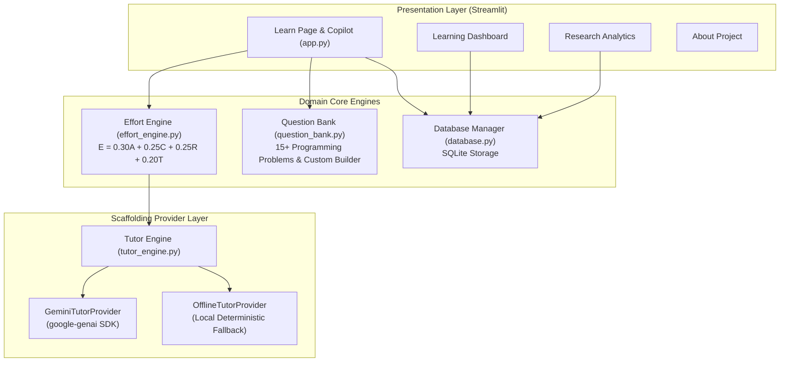

# System Architecture Specification

## Project Title
**An Effort-Aware Generative AI Framework for Reducing Cognitive Offloading in Programming Education**

---

## 1. System Overview & Architecture Diagram

The system follows a modular, layered software architecture comprising a presentation layer (Streamlit UI), domain logic engines (Effort Engine, Question Bank, Safe Code Inspector), an AI Scaffolding Provider (Google Gemini SDK with Offline Fallback & Real-Time Copilot), and a local storage layer (SQLite).

---

## 2. Component Descriptions

### 2.1 Effort Engine (`effort_engine.py`)
- **Responsibility:** Evaluates observable interaction signals and computes an explainable effort proxy score bounded $[0, 100]$.
- **Formula:** $E = 0.30 \cdot A + 0.25 \cdot C + 0.25 \cdot R + 0.20 \cdot T$
- **Assistance Mapping:**
  - $E < 35.0 \implies$ Level 1 (Conceptual Hint)
  - $35.0 \le E < 70.0 \implies$ Level 2 (Guided Assistance & Pseudocode)
  - $E \ge 70.0 \implies$ Level 3 (Full Worked Solution)

### 2.2 Tutor Engine (`tutor_engine.py`)
- **Responsibility:** Implements a provider interface for scaffolded assistance generation and real-time AI Copilot chat.
- **Providers:**
  - `GeminiTutorProvider`: Utilizes `google-genai` SDK with strict prompt constraints matching assistance levels.
  - `OfflineTutorProvider`: Local fallback returning pre-authored hints, guided steps, and reference solutions.

### 2.3 Database Layer (`database.py`)
- **Responsibility:** SQLite database management storing student attempt histories, effort scores, assistance levels, and synthetic research benchmarks.
- **Security:** Uses 100% parameterized SQL queries to prevent injection.

---

## 3. Technology Stack & Limitations

- **Language:** Python 3.10+
- **Frontend UI:** Streamlit 1.30+
- **AI Library:** `google-genai` Python SDK
- **Visualizations:** Plotly Express & Pandas
- **Storage:** SQLite 3
- **Deployment Config:** Vercel (`vercel.json`) & Streamlit Cloud
- **Testing:** Pytest
